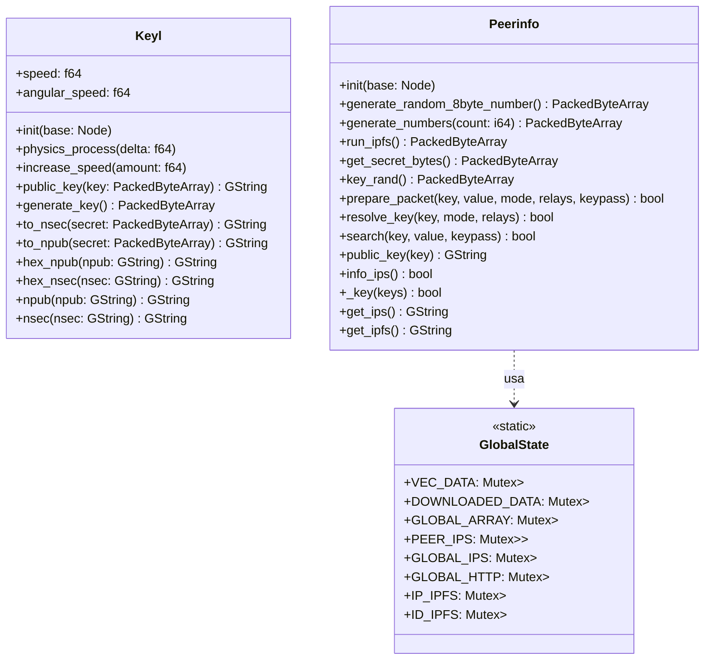
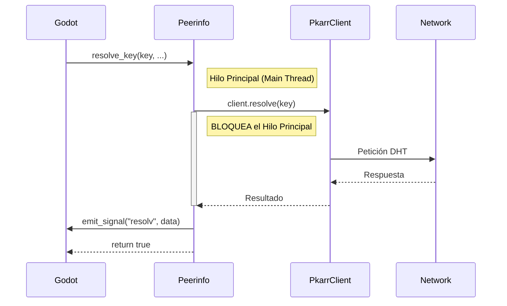
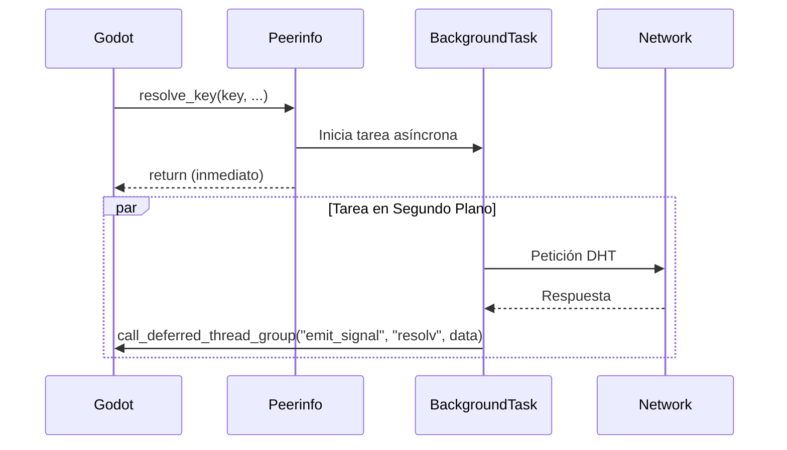

# Análisis del Código Base en Rust (Extensión Pkarr Godot)

Este documento analiza la implementación actual de la extensión de Godot basada en Rust que se encuentra en `pkarr/godot`.

## 1. Arquitectura Actual

La extensión expone dos clases principales a Godot: `Keyl` (probablemente pensada como una herramienta de claves) y `Peerinfo` (que maneja las interacciones con Pkarr).

### Diagrama de Clases

## 2. Análisis de Flujo (Problemas Críticos)

El problema más crítico es el uso de `futures::executor::block_on` dentro del hilo principal de Godot. Esto hace que el juego se congele mientras espera operaciones de red.

### Flujo Bloqueante (Actual)

## 3. Problemas Identificados

1.  **Bloqueo del Hilo Principal**:
    *   **Problema**: Funciones como `resolve_key` y `prepare_packet` usan `block_on`. Esto congela toda la aplicación Godot hasta que la petición de red se completa o expira (timeout).
    *   **Impacto**: Mala experiencia de usuario, la aplicación deja de responder.

2.  **Estado Global Mutable**:
    *   **Problema**: `state.rs` usa variables globales `Mutex` con `lazy_static` (`PEER_IPS`, `GLOBAL_IPS`, etc.).
    *   **Impacto**: Esto hace que el código sea difícil de testear, propenso a condiciones de carrera (race conditions) si existen múltiples nodos `Peerinfo`, y va en contra de la estructura de nodos orientada a objetos de Godot. El estado debería estar encapsulado dentro de la estructura `Peerinfo`.

3.  **Calidad y Limpieza del Código**:
    *   **Código Muerto**: Hay muchos bloques comentados y funciones marcadas como "SIN USO".
    *   **Convenciones de Nombres**: Mezcla de comentarios/logs en inglés y español. El nombre de la clase `Keyl` es poco claro (debería ser `KeyTool` o `NostrKeys`).
    *   **Valores Hardcodeados**: Semillas (seeds) y claves de prueba están escritas directamente en el código en algunas funciones.

4.  **Manejo de Errores**:
    *   **Problema**: Los errores se imprimen en la consola (`godot_error!`), pero las funciones a menudo solo devuelven `false` o cadenas vacías.
    *   **Impacto**: El código GDScript que llama a estas funciones no puede reaccionar fácilmente a errores específicos (por ejemplo, "error de red" vs "clave inválida").

## 4. Mejoras Propuestas

### A. Ejecución Asíncrona (No Bloqueante)
Mover las operaciones de red a un hilo en segundo plano o usar un runtime asíncrono compatible con Godot.

### B. Refactorización de `Peerinfo`
*   Eliminar el estado global. Almacenar los datos en `self` (los campos de la estructura).
*   Usar el runtime de `tokio` (si es posible) o `std::thread` para tareas bloqueantes.

### C. Refactorización de `Keyl`
*   Renombrar a `NostrKeyTool`.
*   Eliminar `physics_process` y otra lógica de nodo no relacionada.
*   Hacer que sea un `RefCounted` o una clase de utilidad puramente estática si no necesita estar en el árbol de escena.

### D. Estandarización
*   Traducir todos los logs y comentarios a un solo idioma (preferiblemente inglés para código fuente, o español si así se requiere, pero consistente).
*   Limpiar el código no utilizado.
